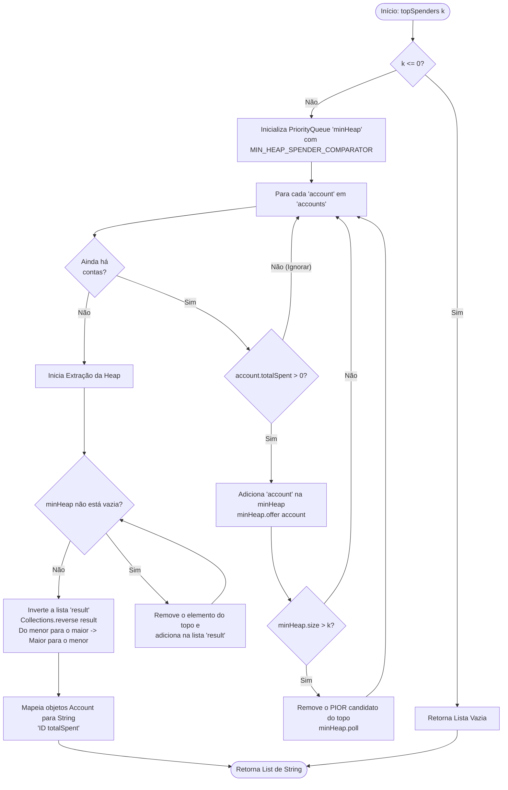
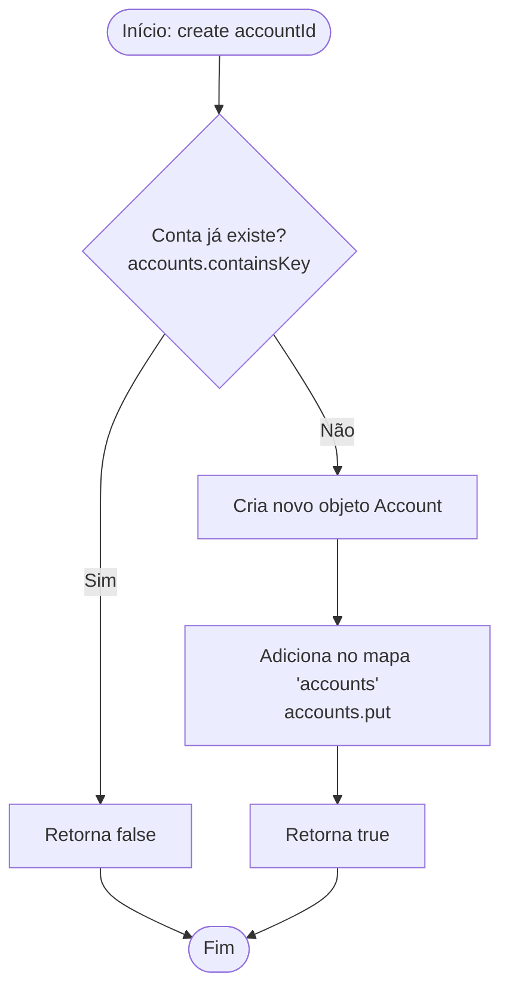
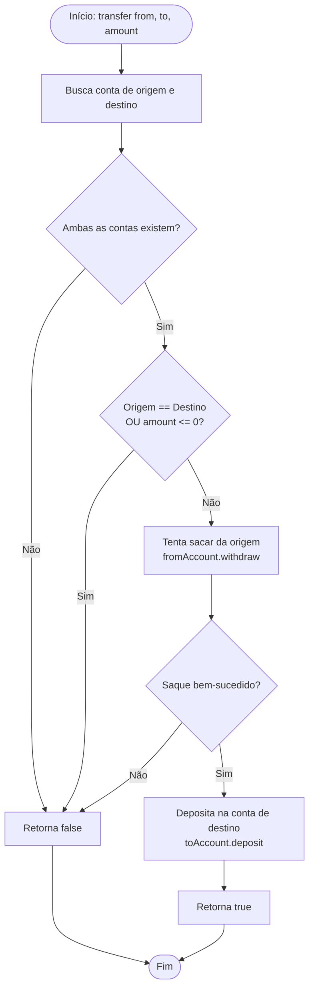
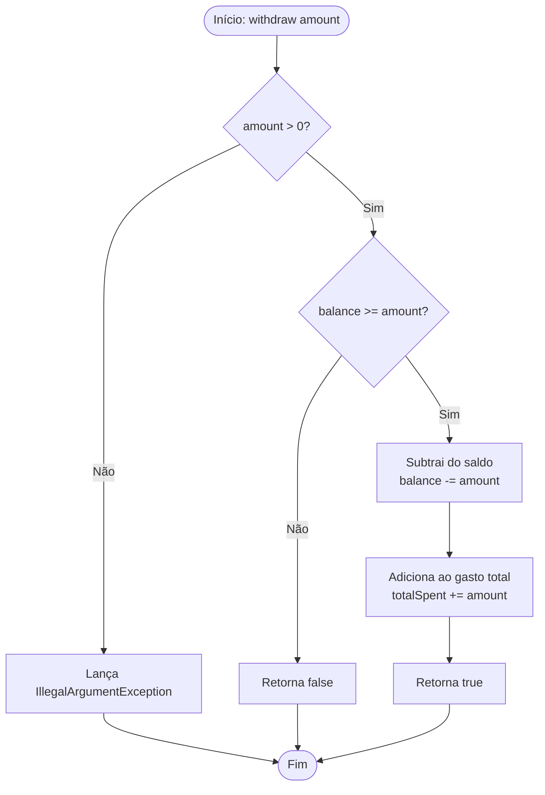

# Mermaid diagrams

## Flow - Top Spenders

---

## Flow - processPendingCashbacks
```mermaid
flowchart TD
    Start([Início: processPendingCashbacks currentTimestamp]) --> CheckQueue{Fila de cashback está vazia?}
    
    CheckQueue -- Sim --> End([Fim])
    CheckQueue -- Não --> PeekQueue[Espia o próximo evento\ncashbackQueue.peek()]

    PeekQueue --> CheckTimestamp{evento.maturityTimestamp <= currentTimestamp?}
    CheckTimestamp -- Não --> End

    CheckTimestamp -- Sim --> PollQueue[Remove evento da fila\ncashbackQueue.poll()]
    PollQueue --> RemoveFromMap[Remove do mapa de pendentes\npendingCashbacks.remove]
    RemoveFromMap --> IsCancelled{evento foi cancelado?}

    IsCancelled -- Sim --> CheckQueue
    IsCancelled -- Não --> GetAccount[Busca a conta do evento]

    GetAccount --> CheckAccount{Conta existe?}
    CheckAccount -- Não --> CheckQueue
    CheckAccount -- Sim --> CheckAmount{Valor do cashback > 0?}

    CheckAmount -- Não --> CheckQueue
    CheckAmount -- Sim --> DepositCashback[Deposita o valor na conta\naccount.deposit]
    
    DepositCashback --> CheckQueue
```
---

## Flow - create

---

## Flow - deposit
```mermaid
flowchart TD
    Start([Início: deposit accountId, amount]) --> GetAccount[Busca a conta\ngetAccountById]
    
    GetAccount --> CheckAccount{Conta existe?}
    CheckAccount -- Não --> ReturnError[Retorna -1]
    CheckAccount -- Sim --> DepositAmount[Chama account.deposit(amount)]
    
    DepositAmount --> GetBalance[Retorna o novo saldo\naccount.getBalance()]
    
    ReturnError --> End([Fim])
    GetBalance --> End
```
---

## Flow - transfer

---

## Flow - balance (simples)
```mermaid
flowchart TD
    Start([Início: balance accountId]) --> GetAccount[Busca a conta\ngetAccountById]
    
    GetAccount --> CheckAccount{Conta existe?}
    CheckAccount -- Não --> ReturnError[Retorna -1]
    CheckAccount -- Sim --> GetBalance[Retorna o saldo atual\naccount.getBalance()]
    
    ReturnError --> End([Fim])
    GetBalance --> End
```
---

## Flow - balance (com timestamp)
```mermaid
flowchart TD
    Start([Início: balance accountId, timestamp]) --> ProcessCashbacks(Chama processPendingCashbacks(timestamp))
    ProcessCashbacks --> CallSimpleBalance[Chama a versão simples\nbalance(accountId)]
    CallSimpleBalance --> End([Retorna o resultado])
```
---

## Flow - payment
```mermaid
flowchart TD
    Start([Início: payment accountId, amount, timestamp]) --> ProcessCashbacks(Chama processPendingCashbacks(timestamp))
    
    ProcessCashbacks --> ValidateAmount{amount > 0?}
    ValidateAmount -- Não --> ReturnFalse[Retorna false]
    
    ValidateAmount -- Sim --> GetAccount[Busca a conta]
    GetAccount --> CheckAccount{Conta existe?}
    CheckAccount -- Não --> ReturnFalse
    
    CheckAccount -- Sim --> Withdraw[Chama saque com timestamp\naccount.withdraw(amount, timestamp)]
    Withdraw --> End([Retorna o resultado do saque])
    
    ReturnFalse --> End
```
---

## Flow - paymentWithCashback
```mermaid
flowchart TD
    Start([Início: paymentWithCashback]) --> ProcessCashbacks(Chama processPendingCashbacks(timestamp))
    
    ProcessCashbacks --> ValidateInput{amount > 0 E 0 <= percent <= 100?}
    ValidateInput -- Não --> ReturnNull[Retorna null]
    
    ValidateInput -- Sim --> GetAccount[Busca a conta]
    GetAccount --> CheckAccount{Conta existe?}
    CheckAccount -- Não --> ReturnNull
    
    CheckAccount -- Sim --> Withdraw[Tenta sacar da conta\naccount.withdraw(amount, timestamp)]
    Withdraw --> CheckWithdraw{Saque bem-sucedido?}
    CheckWithdraw -- Não --> ReturnNull
    
    CheckWithdraw -- Sim --> CalcCashback[Calcula valor do cashback]
    CalcCashback --> GenTxId[Gera ID da transação\n'TX-' + ++sequence]
    GenTxId --> StoreTx[Armazena a transação no mapa 'transactions']
    
    StoreTx --> CheckCashbackAmount{cashbackAmount > 0?}
    CheckCashbackAmount -- Não --> ReturnTxId[Retorna transactionId]
    
    CheckCashbackAmount -- Sim --> CreateEvent[Cria CashbackEvent com timestamp futuro]
    CreateEvent --> OfferToQueue[Adiciona evento na 'cashbackQueue']
    OfferToQueue --> AddToMap[Adiciona evento no mapa 'pendingCashbacks']
    AddToMap --> ReturnTxId
    
    ReturnNull --> End([Fim])
    ReturnTxId --> End
```
---

## Flow - refund
```mermaid
flowchart TD
    Start([Início: refund accountId, txId, timestamp]) --> ProcessCashbacks(Chama processPendingCashbacks(timestamp))
    
    ProcessCashbacks --> GetTx[Busca a transação pelo txId]
    GetTx --> CheckTx{Transação existe E não foi reembolsada?}
    CheckTx -- Não --> ReturnFalse[Retorna false]
    
    CheckTx -- Sim --> CheckAccountMatch{ID da conta na TX == accountId?}
    CheckAccountMatch -- Não --> ReturnFalse
    
    CheckAccountMatch -- Sim --> GetAccount[Busca a conta]
    GetAccount --> CheckAccountExists{Conta existe?}
    CheckAccountExists -- Não --> ReturnFalse
    
    CheckAccountExists -- Sim --> MarkRefunded[Marca transação como reembolsada]
    MarkRefunded --> CallRefund[Chama account.refund(amount, timestamp)]
    
    CallRefund --> RemovePending[Remove cashback pendente do mapa 'pendingCashbacks']
    RemovePending --> CheckPending{Havia evento pendente?}
    
    CheckPending -- Não --> ReturnTrue[Retorna true]
    CheckPending -- Sim --> CancelEvent[Chama pendingEvent.cancel()]
    CancelEvent --> ReturnTrue
    
    ReturnFalse --> End([Fim])
    ReturnTrue --> End
```
---

## Flow - spentInWindow
```mermaid
flowchart TD
    Start([Início: spentInWindow]) --> ProcessCashbacks(Chama processPendingCashbacks(currentTimestamp))
    
    ProcessCashbacks --> ValidateWindow{windowSizeMs >= 0?}
    ValidateWindow -- Não --> ReturnZero[Retorna 0]
    
    ValidateWindow -- Sim --> GetAccount[Busca a conta]
    GetAccount --> CheckAccount{Conta existe?}
    CheckAccount -- Não --> ReturnZero
    
    CheckAccount -- Sim --> CalcStart[Calcula startTimestamp]
    CalcStart --> CallSpentInWindow[Chama account.getSpentInWindow(start, end)]
    CallSpentInWindow --> End([Retorna o resultado])
    
    ReturnZero --> End
```
---

# Account Class Flows

## Flow - Account.withdraw (simples)

---

## Flow - Account.withdraw (com timestamp)
```mermaid
flowchart TD
    Start([Início: withdraw amount, timestamp]) --> CallSimpleWithdraw[Chama withdraw(amount)]
    
    CallSimpleWithdraw --> CheckResult{Resultado é true?}
    CheckResult -- Não --> ReturnFalse[Retorna false]
    
    CheckResult -- Sim --> MergeHistory[Adiciona/soma no histórico\nspendingHistory.merge]
    MergeHistory --> ReturnTrue[Retorna true]
    
    ReturnFalse --> End([Fim])
    ReturnTrue --> End
```
---

## Flow - Account.refund
```mermaid
flowchart TD
    Start([Início: refund amount, timestamp]) --> UpdateBalance[Adiciona valor ao saldo\nbalance += amount]
    UpdateBalance --> UpdateSpent[Subtrai do gasto total\nMath.max(0, totalSpent - amount)]
    
    UpdateSpent --> CheckHistory{Histórico contém o timestamp?}
    CheckHistory -- Não --> End([Fim])
    
    CheckHistory -- Sim --> GetCurrentAmount[Pega o valor gasto no timestamp]
    GetCurrentAmount --> CompareAmount{valor no histórico <= amount?}
    
    CompareAmount -- Sim --> RemoveFromHistory[Remove a entrada do histórico]
    RemoveFromHistory --> End
    
    CompareAmount -- Não --> UpdateHistory[Subtrai 'amount' do valor no histórico]
    UpdateHistory --> End
```
---

## Flow - Account.getSpentInWindow
```mermaid
flowchart TD
    Start([Início: getSpentInWindow start, end]) --> ValidateTimestamps{start > end?}
    ValidateTimestamps -- Sim --> ReturnZero[Retorna 0]
    
    ValidateTimestamps -- Não --> GetSubMap[Cria uma sub-visualização do mapa\nspendingHistory.subMap(start, true, end, true)]
    GetSubMap --> InitTotal[Inicializa total = 0]
    
    InitTotal --> LoopSubMap[Para cada 'amount' nos valores do subMap]
    LoopSubMap --> HasMore{Ainda há valores?}
    
    HasMore -- Não --> ReturnTotal[Retorna total]
    HasMore -- Sim --> AddToTotal[soma amount ao total]
    AddToTotal --> LoopSubMap
    
    ReturnZero --> End([Fim])
    ReturnTotal --> End
```
---
