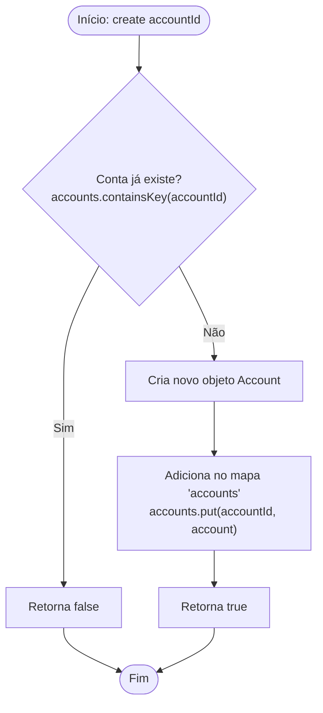
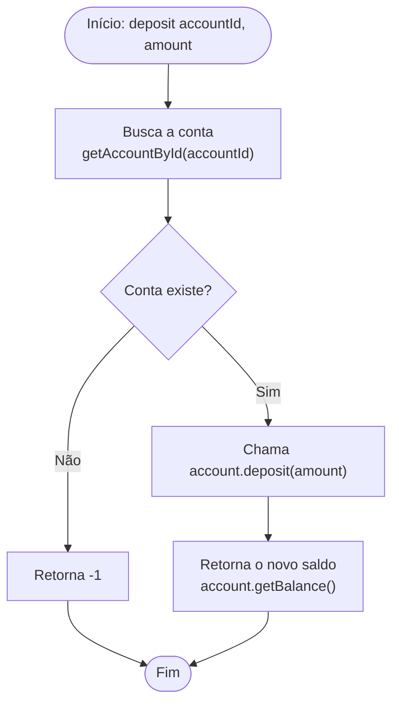
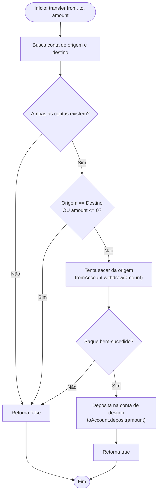
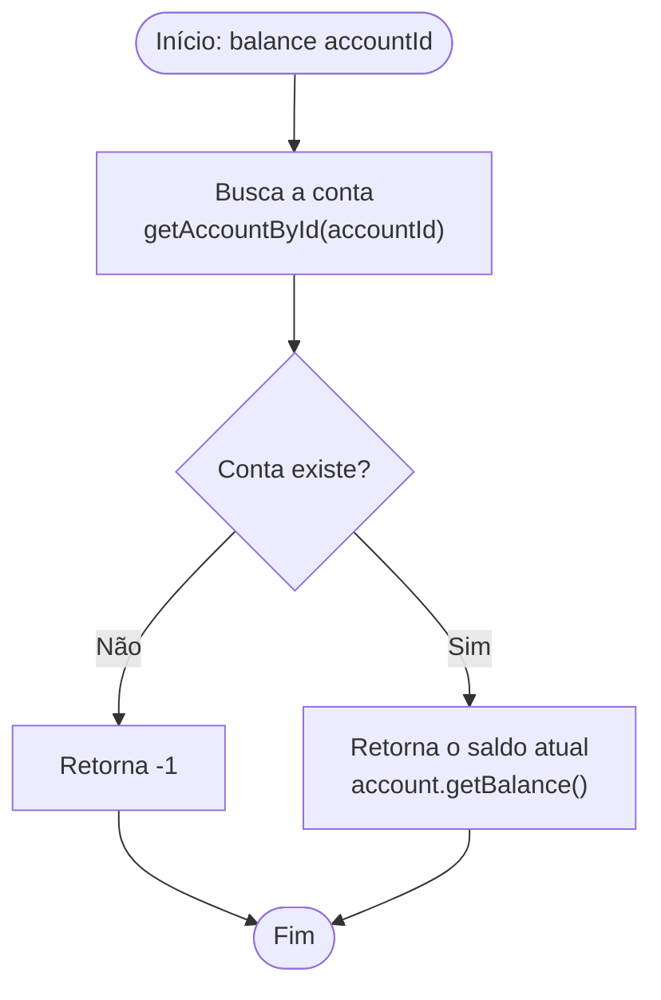

# Mermaid diagrams

## Flow - create

```mermaid
flowchart TD
    Start([Início: create accountId]) --> CheckExists{"Conta já existe?\naccounts.containsKey(accountId)"}
    
    CheckExists -- Sim --> ReturnFalse[Retorna false]
    CheckExists -- Não --> CreateAccount[Cria novo objeto Account]
    
    CreateAccount --> PutInMap["Adiciona no mapa 'accounts'\naccounts.put(accountId, account)"]
    PutInMap --> ReturnTrue[Retorna true]

    ReturnFalse --> End([Fim])
    ReturnTrue --> End
```
---

## Flow - deposit

```mermaid
flowchart TD
    Start([Início: deposit accountId, amount]) --> GetAccount["Busca a conta\ngetAccountById(accountId)"]
    
    GetAccount --> CheckAccount{Conta existe?}
    CheckAccount -- Não --> ReturnError[Retorna -1]
    CheckAccount -- Sim --> DepositAmount["Chama account.deposit(amount)"]
    
    DepositAmount --> GetBalance["Retorna o novo saldo\naccount.getBalance()"]
    
    ReturnError --> End([Fim])
    GetBalance --> End
```
---

## Flow - transfer

```mermaid
flowchart TD
    Start([Início: transfer from, to, amount]) --> GetAccounts[Busca conta de origem e destino]
    
    GetAccounts --> CheckAccounts{Ambas as contas existem?}
    CheckAccounts -- Não --> ReturnFalse[Retorna false]
    
    CheckAccounts -- Sim --> ValidateInput{Origem == Destino\nOU amount <= 0?}
    ValidateInput -- Sim --> ReturnFalse
    
    ValidateInput -- Não --> Withdraw["Tenta sacar da origem\nfromAccount.withdraw(amount)"]
    
    Withdraw --> CheckWithdraw{Saque bem-sucedido?}
    CheckWithdraw -- Não --> ReturnFalse
    
    CheckWithdraw -- Sim --> Deposit["Deposita na conta de destino\ntoAccount.deposit(amount)"]
    Deposit --> ReturnTrue[Retorna true]

    ReturnFalse --> End([Fim])
    ReturnTrue --> End
```
---

## Flow - balance (simples)

```mermaid
flowchart TD
    Start([Início: balance accountId]) --> GetAccount["Busca a conta\ngetAccountById(accountId)"]
    
    GetAccount --> CheckAccount{Conta existe?}
    CheckAccount -- Não --> ReturnError[Retorna -1]
    CheckAccount -- Sim --> GetBalance["Retorna o saldo atual\naccount.getBalance()"]
    
    ReturnError --> End([Fim])
    GetBalance --> End
```
---
