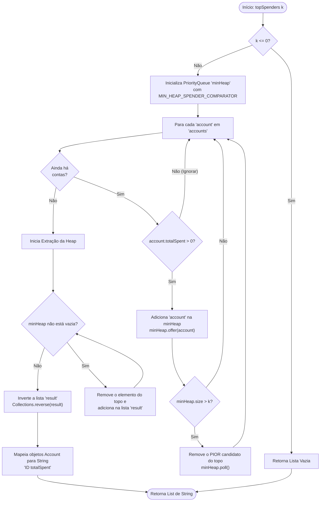
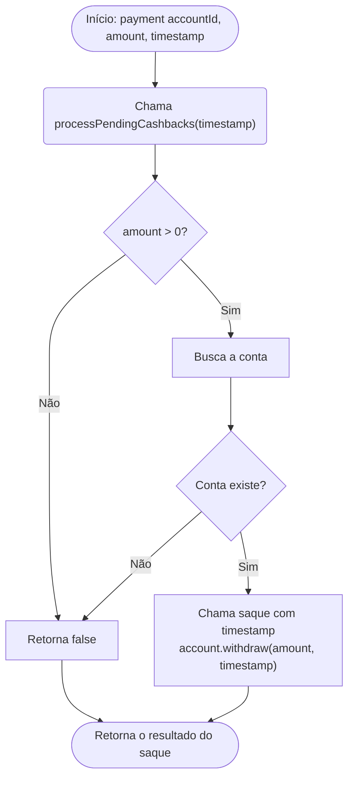

# Mermaid diagrams

## Flow - Top Spenders

```mermaid
flowchart TD
    Start([Início: topSpenders k]) --> CheckK{k <= 0?}
    
    %% Validação Inicial
    CheckK -- Sim --> ReturnEmpty[Retorna Lista Vazia]
    CheckK -- Não --> InitHeap[Inicializa PriorityQueue 'minHeap'\ncom MIN_HEAP_SPENDER_COMPARATOR]

    %% Loop pelas contas
    InitHeap --> LoopAccounts[Para cada 'account' em 'accounts']
    
    LoopAccounts --> HasMore{Ainda há\ncontas?}
    
    HasMore -- Não --> ExtractHeap[Inicia Extração da Heap]
    
    HasMore -- Sim --> CheckSpent{account.totalSpent > 0?}
    
    CheckSpent -- Não (Ignorar) --> LoopAccounts
    
    CheckSpent -- Sim --> OfferHeap["Adiciona 'account' na minHeap\nminHeap.offer(account)"]
    
    OfferHeap --> CheckSize{minHeap.size > k?}
    
    CheckSize -- Sim --> PollHeap["Remove o PIOR candidato do topo\nminHeap.poll()"]
    CheckSize -- Não --> LoopAccounts
    PollHeap --> LoopAccounts

    %% Processamento do Resultado
    ExtractHeap --> WhileHeap{minHeap não está vazia?}
    
    WhileHeap -- Sim --> PollToResult["Remove o elemento do topo e\nadiciona na lista 'result'"]
    PollToResult --> WhileHeap
    
    WhileHeap -- Não --> ReverseResult["Inverte a lista 'result'\nCollections.reverse(result)"]
    
    ReverseResult --> FormatList[Mapeia objetos Account para String\n'ID totalSpent']
    
    FormatList --> End([Retorna List de String])
    ReturnEmpty --> End
```
---

## Flow - payment

```mermaid
flowchart TD
    Start([Início: payment accountId, amount, timestamp]) --> ProcessCashbacks("Chama processPendingCashbacks(timestamp)")
    
    ProcessCashbacks --> ValidateAmount{amount > 0?}
    ValidateAmount -- Não --> ReturnFalse[Retorna false]
    
    ValidateAmount -- Sim --> GetAccount[Busca a conta]
    GetAccount --> CheckAccount{Conta existe?}
    CheckAccount -- Não --> ReturnFalse
    
    CheckAccount -- Sim --> Withdraw["Chama saque com timestamp\naccount.withdraw(amount, timestamp)"]
    Withdraw --> End([Retorna o resultado do saque])
    
    ReturnFalse --> End
```
---
