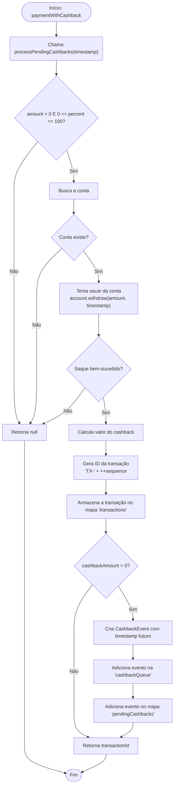
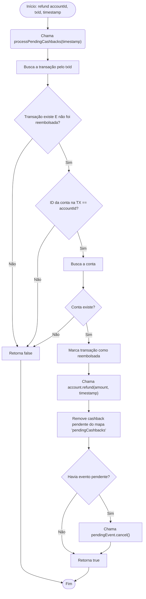
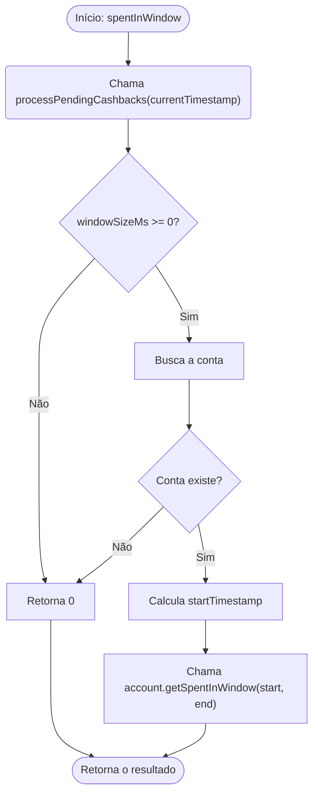

# Mermaid diagrams

## Flow - paymentWithCashback

```mermaid
flowchart TD
    Start([Início: paymentWithCashback]) --> ProcessCashbacks("Chama processPendingCashbacks(timestamp)")
    
    ProcessCashbacks --> ValidateInput{amount > 0 E 0 <= percent <= 100?}
    ValidateInput -- Não --> ReturnNull[Retorna null]
    
    ValidateInput -- Sim --> GetAccount[Busca a conta]
    GetAccount --> CheckAccount{Conta existe?}
    CheckAccount -- Não --> ReturnNull
    
    CheckAccount -- Sim --> Withdraw["Tenta sacar da conta\naccount.withdraw(amount, timestamp)"]
    Withdraw --> CheckWithdraw{Saque bem-sucedido?}
    CheckWithdraw -- Não --> ReturnNull
    
    CheckWithdraw -- Sim --> CalcCashback[Calcula valor do cashback]
    CalcCashback --> GenTxId[Gera ID da transação\n'TX-' + ++sequence]
    GenTxId --> StoreTx[Armazena a transação no mapa 'transactions']
    
    StoreTx --> CheckCashbackAmount{cashbackAmount > 0?}
    CheckCashbackAmount -- Não --> ReturnTxId[Retorna transactionId]
    
    CheckCashbackAmount -- Sim --> CreateEvent[Cria CashbackEvent com timestamp futuro]
    CreateEvent --> OfferToQueue["Adiciona evento na 'cashbackQueue'"]
    OfferToQueue --> AddToMap["Adiciona evento no mapa 'pendingCashbacks'"]
    AddToMap --> ReturnTxId
    
    ReturnNull --> End([Fim])
    ReturnTxId --> End
```
---

## Flow - refund

```mermaid
flowchart TD
    Start([Início: refund accountId, txId, timestamp]) --> ProcessCashbacks("Chama processPendingCashbacks(timestamp)")
    
    ProcessCashbacks --> GetTx[Busca a transação pelo txId]
    GetTx --> CheckTx{Transação existe E não foi reembolsada?}
    CheckTx -- Não --> ReturnFalse[Retorna false]
    
    CheckTx -- Sim --> CheckAccountMatch{ID da conta na TX == accountId?}
    CheckAccountMatch -- Não --> ReturnFalse
    
    CheckAccountMatch -- Sim --> GetAccount[Busca a conta]
    GetAccount --> CheckAccountExists{Conta existe?}
    CheckAccountExists -- Não --> ReturnFalse
    
    CheckAccountExists -- Sim --> MarkRefunded[Marca transação como reembolsada]
    MarkRefunded --> CallRefund["Chama account.refund(amount, timestamp)"]
    
    CallRefund --> RemovePending["Remove cashback pendente do mapa 'pendingCashbacks'"]
    RemovePending --> CheckPending{Havia evento pendente?}
    
    CheckPending -- Não --> ReturnTrue[Retorna true]
    CheckPending -- Sim --> CancelEvent["Chama pendingEvent.cancel()"]
    CancelEvent --> ReturnTrue
    
    ReturnFalse --> End([Fim])
    ReturnTrue --> End
```
---

## Flow - spentInWindow

```mermaid
flowchart TD
    Start([Início: spentInWindow]) --> ProcessCashbacks("Chama processPendingCashbacks(currentTimestamp)")
    
    ProcessCashbacks --> ValidateWindow{windowSizeMs >= 0?}
    ValidateWindow -- Não --> ReturnZero[Retorna 0]
    
    ValidateWindow -- Sim --> GetAccount[Busca a conta]
    GetAccount --> CheckAccount{Conta existe?}
    CheckAccount -- Não --> ReturnZero
    
    CheckAccount -- Sim --> CalcStart[Calcula startTimestamp]
    CalcStart --> CallSpentInWindow["Chama account.getSpentInWindow(start, end)"]
    CallSpentInWindow --> End([Retorna o resultado])
    
    ReturnZero --> End
```
---
