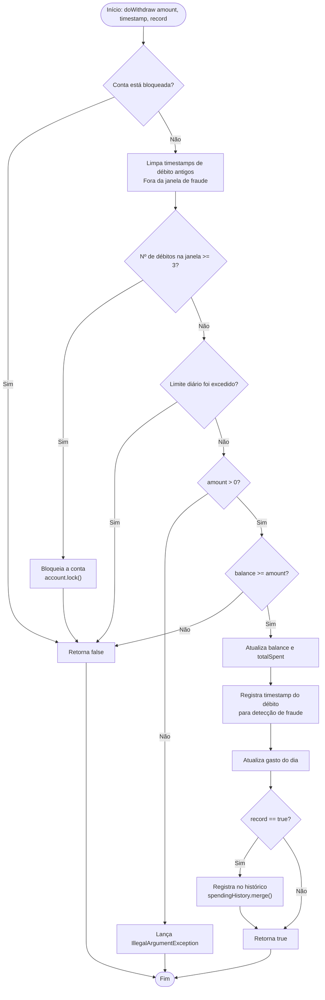
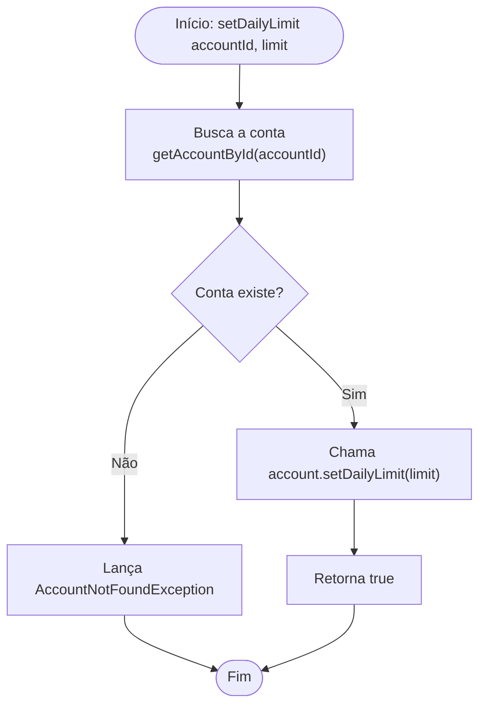
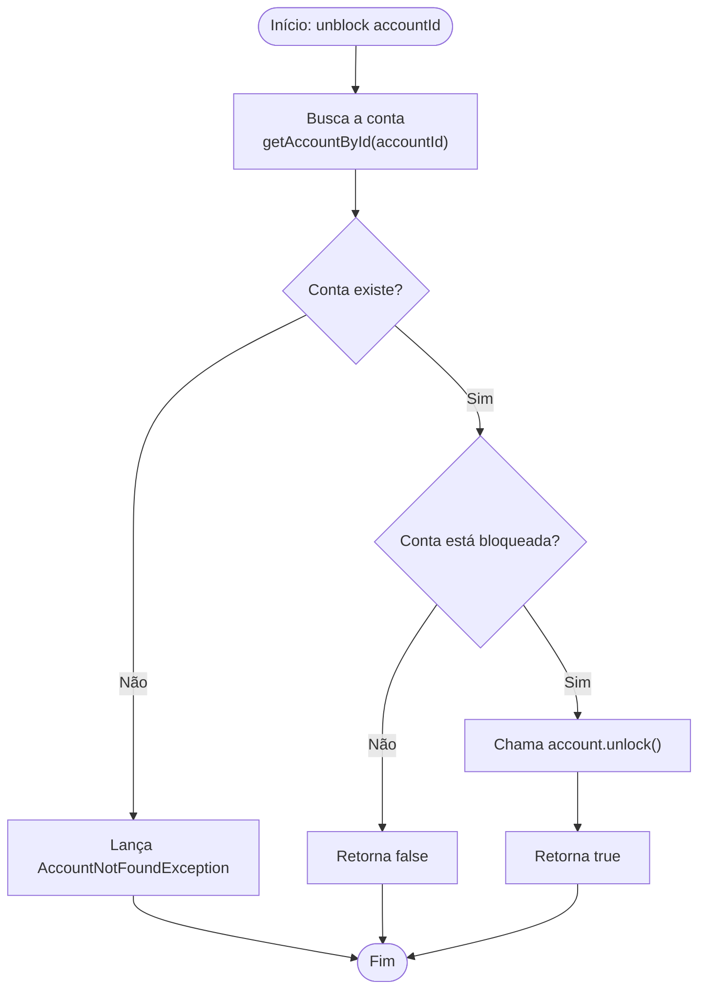
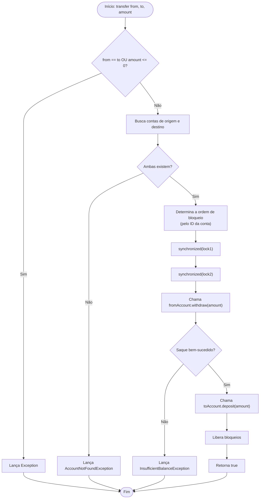

# Mermaid Diagrams - Level 4

## Flow - Account.doWithdraw (New Internal Logic)

```mermaid
flowchart TD
    Start([Início: doWithdraw amount, timestamp, record]) --> IsLocked{Conta está bloqueada?}
    IsLocked -- Sim --> ReturnFalse[Retorna false]

    IsLocked -- Não --> CleanTimestamps["Limpa timestamps de débito antigos\nFora da janela de fraude"]
    CleanTimestamps --> CheckFraud{Nº de débitos na janela >= 3?}
    CheckFraud -- Sim --> LockAccount["Bloqueia a conta\naccount.lock()"] --> ReturnFalse

    CheckFraud -- Não --> CheckLimit{Limite diário foi excedido?}
    CheckLimit -- Sim --> ReturnFalse

    CheckLimit -- Não --> ValidateAmount{amount > 0?}
    ValidateAmount -- Não --> ThrowException[Lança IllegalArgumentException]
    
    ValidateAmount -- Sim --> CheckBalance{balance >= amount?}
    CheckBalance -- Não --> ReturnFalse
    
    CheckBalance -- Sim --> UpdateState["Atualiza balance e totalSpent"]
    UpdateState --> RecordDebit["Registra timestamp do débito\npara detecção de fraude"]
    RecordDebit --> UpdateDailySpending["Atualiza gasto do dia"]
    
    UpdateDailySpending --> ShouldRecord{record == true?}
    ShouldRecord -- Sim --> RecordHistory["Registra no histórico\nspendingHistory.merge()"] --> ReturnTrue[Retorna true]
    ShouldRecord -- Não --> ReturnTrue

    ThrowException --> End([Fim])
    ReturnFalse --> End
    ReturnTrue --> End
```
---

## Flow - setDailyLimit

```mermaid
flowchart TD
    Start([Início: setDailyLimit accountId, limit]) --> GetAccount["Busca a conta\ngetAccountById(accountId)"]
    
    GetAccount --> CheckAccount{Conta existe?}
    CheckAccount -- Não --> ThrowNotFound[Lança AccountNotFoundException]
    
    CheckAccount -- Sim --> SetLimit["Chama account.setDailyLimit(limit)"]
    SetLimit --> ReturnTrue[Retorna true]

    ThrowNotFound --> End([Fim])
    ReturnTrue --> End
```
---

## Flow - unblock

```mermaid
flowchart TD
    Start([Início: unblock accountId]) --> GetAccount["Busca a conta\ngetAccountById(accountId)"]
    
    GetAccount --> CheckAccount{Conta existe?}
    CheckAccount -- Não --> ThrowNotFound[Lança AccountNotFoundException]
    
    CheckAccount -- Sim --> IsLocked{Conta está bloqueada?}
    IsLocked -- Não --> ReturnFalse[Retorna false]
    
    IsLocked -- Sim --> UnlockAccount["Chama account.unlock()"]
    UnlockAccount --> ReturnTrue[Retorna true]

    ThrowNotFound --> End([Fim])
    ReturnFalse --> End
    ReturnTrue --> End
```
---

## Flow - transfer (Concurrency Safe)

```mermaid
flowchart TD
    Start([Início: transfer from, to, amount]) --> ValidateInput{from == to OU amount <= 0?}
    ValidateInput -- Sim --> ThrowException[Lança Exception]

    ValidateInput -- Não --> GetAccounts[Busca contas de origem e destino]
    GetAccounts --> CheckAccounts{Ambas existem?}
    CheckAccounts -- Não --> ThrowNotFound[Lança AccountNotFoundException]

    CheckAccounts -- Sim --> DetermineLockOrder["Determina a ordem de bloqueio\n(pelo ID da conta)"]
    DetermineLockOrder --> AcquireLock1["synchronized(lock1)"]
    AcquireLock1 --> AcquireLock2["synchronized(lock2)"]
    
    AcquireLock2 --> Withdraw["Chama fromAccount.withdraw(amount)"]
    Withdraw --> CheckWithdraw{Saque bem-sucedido?}
    CheckWithdraw -- Não --> ThrowInsufficientBalance[Lança InsufficientBalanceException]
    
    CheckWithdraw -- Sim --> Deposit["Chama toAccount.deposit(amount)"]
    Deposit --> ReleaseLocks["Libera bloqueios"]
    ReleaseLocks --> ReturnTrue[Retorna true]

    ThrowException --> End([Fim])
    ThrowNotFound --> End
    ThrowInsufficientBalance --> End
    ReturnTrue --> End
```
